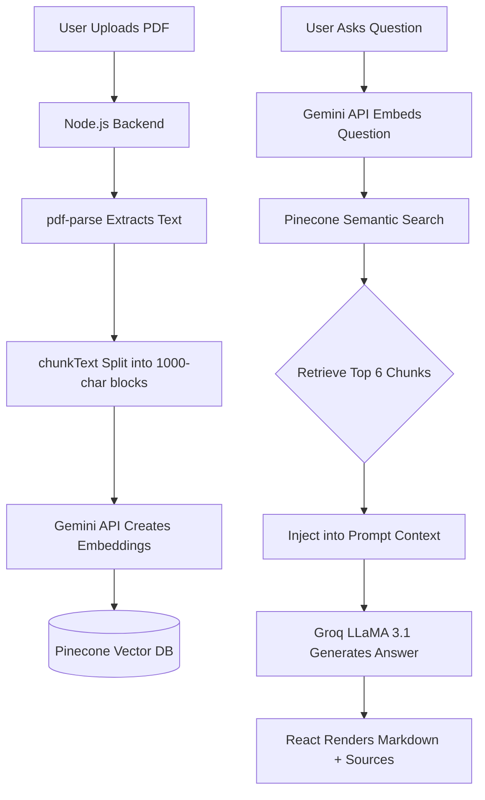

<div align="center">

# 📄 DocuMind
**AI-Powered Multi-Document Q&A Platform**

[](https://documind-tess.onrender.com)
[](#)
[](#)

*Upload PDFs. Ask Questions. Get Instant, Accurate Answers with Citations.*

</div>

---

## 🚀 Overview

DocuMind is a full-stack **Retrieval-Augmented Generation (RAG)** application. It allows users to upload PDF documents, which are instantly processed, chunked, and stored as high-dimensional vector embeddings in Pinecone. Users can then query their documents using natural language. 

By leveraging **Google Gemini** for semantic embeddings and **Groq's LLaMA 3.1** for lightning-fast text generation, DocuMind provides highly accurate answers grounded *strictly* in the provided document context, eliminating AI hallucination.

## ✨ Key Features

- **Multi-Document Isolation:** Pinecone namespacing ensures queries are strictly isolated to the currently active document.
- **Lightning Fast Inference:** Utilizes Groq's LPU hardware to deliver LLaMA 3.1 responses in < 1 second.
- **Semantic Search:** Finds answers based on meaning, not just exact keyword matches.
- **Source Citations:** Every AI answer includes an expandable section showing the exact text chunks used to generate the response.
- **Persistent State:** Chat history and document lists are synced to `localStorage`, allowing you to close and resume sessions seamlessly.
- **Modern UI:** Built with React 19 and Tailwind CSS, featuring drag-and-drop uploads, interactive states, and Markdown rendering.

## 🛠️ Tech Stack

### Frontend
- **Framework:** React 19 (Vite)
- **Styling:** Tailwind CSS v4
- **State Management:** React Hooks + LocalStorage
- **Rendering:** `react-markdown`, `@tailwindcss/typography`

### Backend
- **Server:** Node.js, Express.js
- **File Parsing:** `multer` (memory storage), `pdf-parse`
- **Vector Database:** Pinecone (HNSW Indexing)
- **Embedding Model:** Google `gemini-embedding-001`
- **Generation Model:** Meta `llama-3.1-8b-instant` (via Groq API)

### Deployment
- **Frontend:** Vercel
- **Backend:** Render

---

## 🧠 Architecture & RAG Pipeline



---

## ⚙️ Getting Started (Local Development)

Want to run DocuMind locally? Follow these steps:

### 1. Prerequisites
- Node.js installed on your machine
- Free API keys from: [Pinecone](https://pinecone.io/), [Google AI Studio](https://aistudio.google.com/), and [Groq](https://console.groq.com/)

### 2. Clone the Repository
```bash
git clone https://github.com/YOUR_USERNAME/documind.git
cd documind
```

### 3. Backend Setup
```bash
# Install dependencies
npm install

# Create a .env file and add your keys
touch .env
```
Inside `.env`, add:
```env
PINECONE_API_KEY=your_pinecone_key_here
GEMINI_API_KEY=your_gemini_key_here
GROQ_API_KEY=your_groq_key_here
```
```bash
# Start the backend server
node server.js
```

### 4. Frontend Setup
Open a new terminal window:
```bash
cd frontend
npm install

# Start the Vite development server
npm run dev
```
The app will be running at `http://localhost:5173`.

---

## 📂 Project Structure

```text
documind/
├── server.js                 # Express server & RAG pipeline logic
├── .env                      # Backend API keys (GitIgnored)
├── package.json              # Backend dependencies
└── frontend/                 # React Application
    ├── src/
    │   ├── App.jsx           # Main state container (Smart Component)
    │   ├── components/
    │   │   ├── ChatArea.jsx  # Chat UI & Markdown rendering
    │   │   ├── Sidebar.jsx   # Document list & Navigation
    │   │   └── UploadBox.jsx # Drag & Drop logic
    │   ├── index.css         # Tailwind directives
    │   └── main.jsx          # React entry point
    ├── vite.config.js
    └── package.json          # Frontend dependencies
```

---

<div align="center">
  <i>Built as a portfolio project demonstrating modern AI infrastructure and Full-Stack development.</i>
</div>
